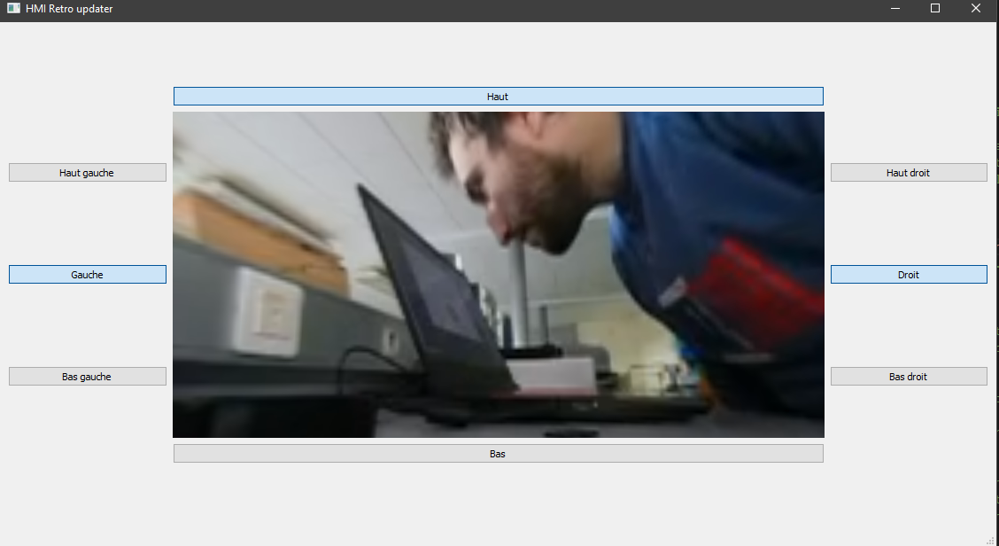

# 360 Video Viewer


<h1 align="center">
  <br>
  </a>
  <br>
  <b>yuzu</b>
  <br>
</h1>


## What ?
This project aim to simulate the viewing of an rtsp 360 video stream inside a window

Currently the project is made for a windows os target but it should work just as well on linux

## Install dependency

Python dependency : 
1. Start a python venv : 
```
..\360video_viewer> python -m venv venv
```
2. Get in the venv : 
```
..\360video_viewer> .\venv\Script\activate
```
3. Install package : 
```
..\360video_viewer\rtsp> pip install -r requirements.txt
```

FFmpeg : 
1. Download FFmpeg for windows from the website : https://ffmpeg.org/download.html
2. Add FFmpeg binary to your path

## Start program

1. Start the rtsp_server.exe inside the rtsp folder
2. Start the program : python 360_viewer.py
> the rtsp server expect a `stitch.mp4` 360 video file inside the rtsp folder